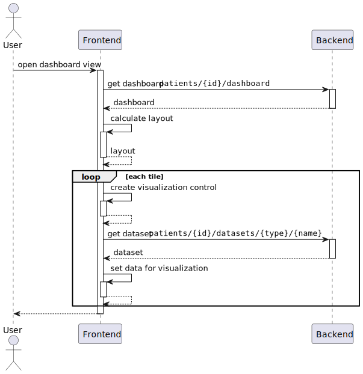

# Driver: Customizable Layout

## Categorisation

ID
: DRIVER.CUSTOMIZABLE.LAYOUT

Name
: Customizable Layout

Status
: UNDER DESIGN

Priority
: HIGH

## Responsibilities

Supporter
: Bernd Rauch

Sponsor
: Bernd Rauch

Author
: Stefan Schweitzer

Inspector
: Matthias Gerbershagen

## Description

The layout and the information displayed on the dashboard should automatically adapt to the user's situation and the information they require.

In the first step, the information displayed should be predefined.
Later, an administrator will be able to define this.
And in the future, it should be possible to determine the required information automatically based on rules.

|             | Description | Quantification |
|-------------|-------------|----------------|
| Environment |             |                |
| Stimulus    |             |                |
| Response    |             |                |

# Driver: Extensible Layout

## Categorisation

ID
: DRIVER.LAYOUT.EXTENSIBLE

Name
: Extensible Layout

Status
: UNDER DESIGN

Priority
: HIGH

## Responsibilities

Supporter
: Bernd Rauch

Sponsor
: Bernd Rauch

Author
: Stefan Schweitzer

Inspector
: Matthias Gerbershagen

## Description

The data displayed in the dashboard and how they are visualized can be very wide-ranging and are not yet fully defined at the beginning.
Therefore, it must be possible to extend the layout of the dashboard with additional types for the data and their representations.

|             | Description | Quantification |
|-------------|-------------|----------------|
| Environment |             |                |
| Stimulus    |             |                |
| Response    |             |                |

# Concept: Dashboard Layout

ID
: CONCEPT.LAYOUT

Name
: Layout

## Addressed Drivers

- [Customizable Layout](#driver-customizable-layout)
- [Extensible Layout](#driver-extensible-layout)

## Description/Steps

1. The backend provides information about the tiles to be displayed on the dashboard to the frontend.
    - Metadata is also supplied for each tile, which provides information, such as constraints, for the layout.
2. The frontend uses this information to generate a suitable layout for the tiles and positions them.
    - A control element is created for each tile based on the representation information and the data for this is retrieved using the dataset information.
    - The frontend always generates a deterministic layout for the same dashboard model with the same device state.

## Design Decisions

- [Layouting in the frontend with hints](#decision-layouting-in-the-frontend-with-hints)

## Diagrams

## References

### Layouting Algorithms

- [Auto-placement in grid layout](https://developer.mozilla.org/en-US/docs/Web/CSS/CSS_grid_layout/Auto-placement_in_grid_layout)

### Examples for Dashboard Formats

- Grafana: https://grafana.com/docs/grafana/latest/dashboards/build-dashboards/view-dashboard-json-model/
- Datadog: https://docs.datadoghq.com/api/latest/dashboards/
- Dynatrace https://docs.dynatrace.com/docs/dynatrace-api/configuration-api/dashboards-api/post-dashboard
- Salesforce: https://developer.salesforce.com/docs/atlas.en-us.bi_dev_guide_json.meta/bi_dev_guide_json/bi_dbjson_wave_designer.htm
- Google: https://cloud.google.com/monitoring/api/ref_v3/rest/v1/projects.dashboards#Dashboard
- DevExpress: https://docs.devexpress.com/Dashboard/DevExpress.DashboardCommon.Dashboard
- Azure: https://learn.microsoft.com/en-us/azure/azure-portal/azure-portal-dashboards-structure

# Decision: Layouting in the frontend with hints

ID
: DECISION.LAYOUT.FRONTEND

Name
: Layouting in the frontend with hints

## Explanation

The backend delivers the tiles to be displayed in the dashboard together with metadata (constraints and preferences) to the frontend.

The frontend uses this information and the device information to determine a suitable layout for the dashboard for the current use and displays it.

## Rationale

The exact layout of the dashboard depends on the device, the resolution of the screen and its orientation and can therefore change during use.
Therefore, the optimal layout can only be determined on the client side.

Nevertheless, hints about the layout must be provided by the backend,
as the backend has more precise details about the information to be displayed and its significance,
which in turn affects the layout.

## Pros

- Information from the device can be taken into account.
- CSS Grid can be used in part for layouting and positioning.

## Cons

- Since the backend is not aware of the final layout, it is possible that not all provided elements will fit into the final layout.

## Assumptions

- Dashboard is rendered on client-side.

## Trade-Offs

- The hints must also be taken into account during layouting.

## Discarded Alternatives

- The backend determines a suitable layout for the dashboard and delivers the exact position of the tiles in it.
- The backend delivers the tiles to be displayed in the dashboard without additional hints. The frontend is entirely responsible for the layout.
